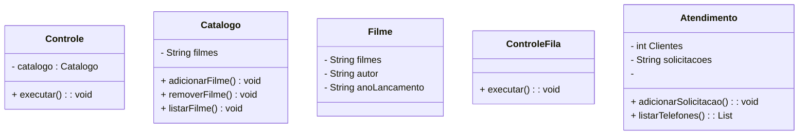

# Lista 3 - Diagramas de classe

## Alunas: Ingridy Aragão e Isabella Corrêa.

```mermaid
classDiagram
    
    %% Catalogo de filmes
    
    class Controle {
        - catalogo : Catalogo
        + executar() : void 
    }
    
    class Catalogo {
        - String filmes
        + adicionarFilme() void
        + removerFilme() void
        + listarFilme() void
    }
    
    class Filme {
        - String filmes
        - String autor
        - String anoLancamento
    }
    
    %% Fila de atendimento.
    
    class ControleFila {
        + executar() : void
    }
    
    class Atendimento {
        - int Clientes
        - String solicitacoes 
        - 
        + adicionarSolicitacao() : void
        + listarTelefones() : List<String>
    }
        
        

```

