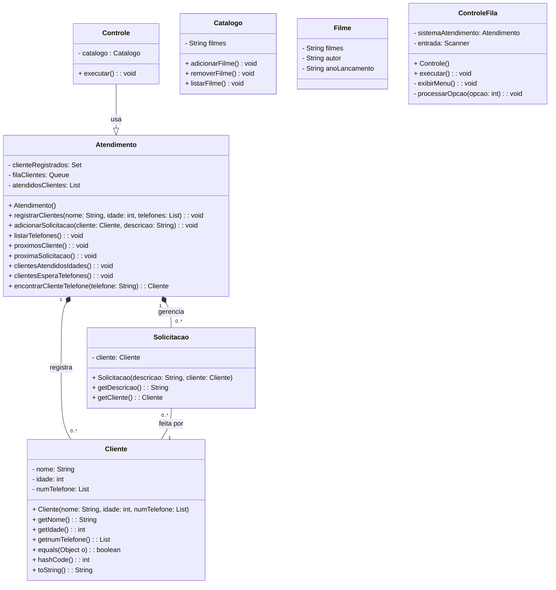

# Lista 3 - Diagramas de classe

## Alunas: Ingridy Aragão e Isabella Corrêa.

### Como Executar

Para compilar e executar o projeto, certifique-se de que o Java Development Kit (JDK) e o Gradle estão instalados e configurados corretamente em sua máquina.

Clone o repositório: git clone <URL_DO_SEU_REPOSITORIO> cd <nome_do_repositorio>

- Navegue até a pasta raiz do projeto Gradle.
- Execute o programa: ./gradlew run (em sistema Linux)
- O programa iniciará com um menu interativo no terminal, permitindo a interação com o sistema de Fila de Atendimento.

